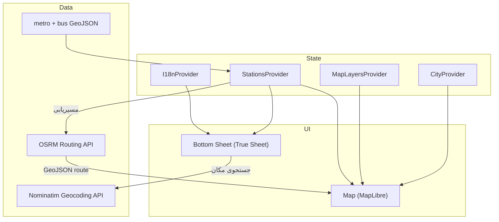

<div dir="rtl" align="right">

# ایستگاه · Istgah

**نقشه تعاملی حمل‌ونقل عمومی — مترو، BRT و اتوبوس؛ چند شهر، مسیریابی، فارسی/انگلیسی و تم روشن/تاریک**

[](https://expo.dev)
[](https://reactnative.dev)
[](https://www.typescriptlang.org)
[](https://maplibre.org)

---

## فهرست مطالب

- [درباره](#درباره)
- [ویژگی‌ها](#ویژگی‌ها)
- [پیش‌نیازها](#پیش‌نیازها)
- [نصب و راه‌اندازی](#نصب-و-راه‌اندازی)
- [اجرای برنامه](#اجرای-برنامه)
- [ساختار پروژه](#ساختار-پروژه)
- [معماری](#معماری)
- [داده‌ها](#داده‌ها)
- [فناوری‌ها](#فناوری‌ها)
- [مشارکت](#مشارکت)
- [مجوز](#مجوز)

---

## درباره

**ایستگاه** یک اپلیکیشن موبایل بومی (React Native) برای کاوش شبکه حمل‌ونقل عمومی در ایران است. ایستگاه‌های **مترو**، **BRT** و **اتوبوس** را روی یک نقشه ببینید، جستجو کنید، جزئیات هر ایستگاه را بخوانید و از موقعیت فعلی‌تان تا مقصد انتخاب‌شده **مسیریابی** دریافت کنید.

از **۶ شهر** (تهران، اصفهان، مشهد، تبریز، کرج، شیراز) شهر پیش‌فرض خود را انتخاب کنید. لایه‌های نقشه را با دکمه‌های بالای صفحه روشن/خاموش کنید. علاوه بر ایستگاه‌ها، **آدرس و مکان** را با API اوپن‌استریت‌مپ جستجو کنید. بین **نمای خیابانی و ماهواره‌ای** نقشه از تنظیمات جابه‌جا شوید. برای ایستگاه‌های اتوبوس و BRT، **زمان رسیدن** را با یک دکمه (شماره‌گیری USSD) بپرسید. رابط کاربری به‌صورت پیش‌فرض از زبان دستگاه پیروی می‌کند و بین **فارسی (RTL)** و **انگلیسی (LTR)** قابل تعویض است؛ **تم روشن و تاریک** نیز از تنظیمات در دسترس است.

---

## ویژگی‌ها

| ویژگی                    | توضیح                                                                                       |
| ------------------------ | ------------------------------------------------------------------------------------------- |
| **نقشه تعاملی**          | نمایش ایستگاه‌ها با MapLibre؛ رنگ هر ایستگاه مترو مطابق خط                                   |
| **مترو، BRT و اتوبوس**   | سه لایه جدا با دکمه‌های بالای صفحه؛ خطوط BRT و ایستگاه‌های اتوبوس تهران                     |
| **چند شهر**              | تهران، اصفهان، مشهد، تبریز، کرج و شیراز — انتخاب شهر پیش‌فرض از تنظیمات                      |
| **جستجوی دوزبانه**       | جستجو با نام فارسی یا انگلیسی؛ جستجوی ایستگاه‌های اتوبوس با تأخیر (debounce)                |
| **جستجوی مکان (API)**    | جستجوی آدرس و مکان با [Nominatim](https://nominatim.openstreetmap.org)؛ محدود به محدوده شهر |
| **نقشه ماهواره‌ای**      | تعویض بین نمای خیابانی (CARTO) و ماهواره‌ای (Esri) از تنظیمات                               |
| **زمان رسیدن اتوبوس**    | دکمه در جزئیات ایستگاه؛ کپی کد و شماره‌گیری USSD `*137*3*7*1#`                              |
| **برگه پایینی بومی**     | تجربه روان با [True Sheet](https://github.com/lodev09/react-native-true-sheet) و Reanimated |
| **مسیریابی**             | مسیر از موقعیت شما تا ایستگاه با OSRM (فاصله و زمان تخمینی)                                 |
| **باز کردن در نقشه**      | ارسال مختصات به اپ نقشه دستگاه برای مسیریابی خارجی                                          |
| **موقعیت‌یابی**          | نمایش موقعیت کاربر روی نقشه و دکمه «مکان من»                                                |
| **فارسی / انگلیسی**      | تعویض زبان و چیدمان RTL از تنظیمات                                                          |
| **تم روشن / تاریک**      | هماهنگ با نقشه و رابط کاربری (Uniwind)                                                      |
| **داده آفلاین**          | ایستگاه‌های مترو و اتوبوس به‌صورت bundle — بدون نیاز به شبکه برای مرور                      |
| **۷ خط مترو + BRT**      | داده کامل ایستگاه‌های فعال متروی تهران و شبکه BRT                                           |

---

## پیش‌نیازها

- [Node.js](https://nodejs.org) 18 یا جدیدتر
- [npm](https://www.npmjs.com) یا [yarn](https://yarnpkg.com)
- برای اندروید: [Android Studio](https://developer.android.com/studio) و SDK
- برای iOS (فقط macOS): [Xcode](https://developer.apple.com/xcode/)

> **توجه:** ماژول‌های بومی **MapLibre** و **True Sheet** در Expo Go به‌طور کامل پشتیبانی نمی‌شوند. برای تجربه کامل (نقشه و برگه پایینی) باید **development build** بسازید.

---

## نصب و راه‌اندازی

```bash
# کلون کردن مخزن
git clone https://github.com/MohsenDastaran/istgah-rn.git
cd istgah-rn

# نصب وابستگی‌ها
npm install

# ساخت پوشه‌های بومی (اولین بار)
npx expo prebuild
```

---

## اجرای برنامه

### سرور توسعه

```bash
npm run dev
```

### اندروید (development build — توصیه‌شده)

```bash
npm run android
# یا
npx expo run:android
```

### iOS

```bash
npm run ios
# یا
npx expo run:ios
```

### وب (نقشه محدود — بدون ماژول بومی MapLibre)

```bash
npm run web
```

### پاک‌سازی کش

```bash
npm run clean
npm install
```

---

## ساختار پروژه

```
istgah-rn/
├── app/                    # صفحات Expo Router
│   ├── _layout.tsx         # لایه ریشه، تم و Providerها
│   └── index.tsx           # صفحه اصلی (نقشه + لایه‌ها + برگه)
├── assets/data/
│   ├── metroStations.ts    # داده خام ایستگاه‌های مترو
│   ├── metroLines.ts       # رنگ و نام خطوط
│   ├── tehranBusStops.json # ایستگاه‌های اتوبوس و BRT تهران
│   └── tehranBRTLines.json # خطوط BRT
├── components/
│   ├── sheet-section.tsx   # برگه پایینی، جستجو، جزئیات
│   ├── settings-panel.tsx  # تنظیمات (نقشه، زبان، تم، شهر)
│   ├── station-layer-toggle.tsx  # کلید مترو / BRT / اتوبوس
│   └── ui/                 # اجزای UI (نقشه، دیالوگ، …)
├── lib/
│   ├── i18n.ts             # ترجمه فارسی / انگلیسی
│   ├── cities.ts           # شهرهای پشتیبانی‌شده
│   ├── bus-stops.ts        # داده و GeoJSON اتوبوس/BRT
│   ├── basemap-context.tsx     # نمای خیابانی / ماهواره‌ای
│   ├── map-styles.ts           # استایل CARTO و Esri
│   ├── geocoding.ts            # جستجوی مکان (Nominatim)
│   ├── use-place-search.ts     # hook جستجوی مکان
│   ├── bus-arrival.ts          # USSD زمان رسیدن اتوبوس
│   ├── map-layers-context.tsx  # لایه‌های نقشه
│   ├── stations-context.tsx    # state انتخاب و مسیریابی
│   └── theme.ts                # تم ناوبری
```

---

## معماری



**جریان کاربر:** انتخاب لایه (مترو / BRT / اتوبوس) → جستجو یا لمس روی نقشه → جزئیات ایستگاه → «مسیریابی» یا «باز کردن در نقشه» → نمایش مسیر OSRM روی نقشه.

---

## داده‌ها

- بیش از **۱۰۰ ایستگاه فعال مترو** در `assets/data/metroStations.ts` (تهران)
- **هزاران ایستگاه اتوبوس و BRT** تهران در `assets/data/tehranBusStops.json`
- خطوط BRT در `assets/data/tehranBRTLines.json`
- خطوط ۱ تا ۷ با رنگ‌های استاندارد در `assets/data/metroLines.ts`
- **۶ شهر** با مرکز نقشه از پیش‌تنظیم‌شده در `lib/cities.ts`
- فقط ایستگاه‌های مترو با `Is Active: "T"` نمایش داده می‌شوند
- مسیریابی از سرویس عمومی [OSRM](https://router.project-osrm.org) (حالت رانندگی؛ تخمینی)
- جستجوی مکان از [Nominatim](https://nominatim.openstreetmap.org) (محدود به bbox هر شهر)
- کاشی ماهواره‌ای از [Esri World Imagery](https://www.arcgis.com/home/item.html?id=10df22758200c4ecb38b050749fbb916)

---

## فناوری‌ها

| لایه        | ابزار                                                                                                                                         |
| ----------- | --------------------------------------------------------------------------------------------------------------------------------------------- |
| فریم‌ورک    | [Expo 56](https://expo.dev) · [React Native 0.85](https://reactnative.dev) · [Expo Router](https://docs.expo.dev/router/introduction/)        |
| زبان        | [TypeScript](https://www.typescriptlang.org)                                                                                                  |
| نقشه        | [@maplibre/maplibre-react-native](https://github.com/maplibre/maplibre-react-native)                                                          |
| UI          | [True Sheet](https://github.com/lodev09/react-native-true-sheet) · [Uniwind](https://uniwind.dev) · [RN Primitives](https://rnprimitives.com) |
| انیمیشن     | [Reanimated 4](https://docs.swmansion.com/react-native-reanimated/)                                                                           |
| موقعیت      | [expo-location](https://docs.expo.dev/versions/latest/sdk/location/)                                                                          |
| استایل نقشه | [CARTO Basemaps](https://carto.com/basemaps) · [Esri World Imagery](https://www.arcgis.com/home/item.html?id=10df22758200c4ecb38b050749fbb916) |
| جستجوی مکان | [Nominatim](https://nominatim.openstreetmap.org) (OpenStreetMap)                                                                                |

---

## مشارکت

۱. Fork کنید  
۲. شاخه feature بسازید (`git checkout -b feature/amazing-feature`)  
۳. تغییرات را commit کنید  
۴. Push به شاخه (`git push origin feature/amazing-feature`)  
۵. Pull Request باز کنید

---

## مجوز

این پروژه در حال حاضر **خصوصی** است (`private: true` در `package.json`). برای استفاده یا توزیع، با نگهدارنده مخزن هماهنگ کنید.

**نگهدارنده:** [Mohsen Dastaran](https://github.com/MohsenDastaran)

</div>

---

<div dir="ltr" align="left">

# Istgah · ایستگاه

**An interactive public transit map — metro, BRT & bus; multi-city, routing, Persian/English, and light/dark mode**

[](https://expo.dev)
[](https://reactnative.dev)
[](https://www.typescriptlang.org)
[](https://maplibre.org)

---

## Table of Contents

- [About](#about)
- [Features](#features)
- [Prerequisites](#prerequisites)
- [Installation](#installation)
- [Running the App](#running-the-app)
- [Project Structure](#project-structure)
- [Architecture](#architecture-1)
- [Data](#data)
- [Tech Stack](#tech-stack)
- [Contributing](#contributing)
- [License](#license)

---

## About

**Istgah** (Persian for _station_) is a native mobile app built with React Native for exploring public transit in Iran. View **metro**, **BRT**, and **regular bus** stops on one map, search by name, read station details, and get **turn-by-turn-style routing** from your location to any stop.

Pick a default city from **6 supported cities** (Tehran, Isfahan, Mashhad, Tabriz, Karaj, Shiraz). Toggle map layers from the header control. Search **addresses and landmarks** via the OpenStreetMap API alongside transit stops. Switch between **street and satellite** basemaps in Settings. For bus and BRT stops, check **arrival times** with one tap (USSD dialer). The UI follows the device locale by default and switches between **Persian (RTL)** and **English (LTR)**; **light and dark themes** are available in Settings.

---

## Features

| Feature                  | Description                                                                                   |
| ------------------------ | --------------------------------------------------------------------------------------------- |
| **Interactive map**      | MapLibre markers colored by metro line                                                        |
| **Metro, BRT & bus**     | Three toggleable layers; Tehran BRT lines and bus stop dataset                                |
| **Multi-city**           | Tehran, Isfahan, Mashhad, Tabriz, Karaj, Shiraz — default city in Settings                  |
| **Bilingual search**     | Filter by Persian or English; debounced bus stop search                                       |
| **Place search (API)**   | Address & landmark lookup via [Nominatim](https://nominatim.openstreetmap.org); city-bounded  |
| **Satellite basemap**    | Street (CARTO) and satellite (Esri) map styles in Settings                                    |
| **Bus arrival inquiry**  | Button on stop details; copies station code and dials USSD `*137*3*7*1#`                       |
| **Native bottom sheet**  | Fluid UX with [True Sheet](https://github.com/lodev09/react-native-true-sheet) and Reanimated |
| **Directions**           | Route from your location via OSRM (distance & ETA)                                            |
| **Open in Maps**         | Hand off coordinates to the device maps app                                                   |
| **User location**        | Live position with a locate-me control                                                        |
| **Persian / English**    | Language switch and RTL layout from Settings                                                  |
| **Light / dark theme**   | Synchronized map basemap and UI chrome (Uniwind)                                              |
| **Offline-ready data**   | Bundled metro and bus datasets — browse without network                                       |
| **7 metro lines + BRT**  | Full active Tehran metro dataset and BRT network                                              |

---

## Prerequisites

- [Node.js](https://nodejs.org) 18+
- [npm](https://www.npmjs.com) or [yarn](https://yarnpkg.com)
- For Android: [Android Studio](https://developer.android.com/studio) and the Android SDK
- For iOS (macOS only): [Xcode](https://developer.apple.com/xcode/)

> **Note:** Native modules **MapLibre** and **True Sheet** are not fully available in Expo Go. Build a **development build** for the complete experience (map + bottom sheet).

---

## Installation

```bash
# Clone the repository
git clone https://github.com/MohsenDastaran/istgah-rn.git
cd istgah-rn

# Install dependencies
npm install

# Generate native projects (first time)
npx expo prebuild
```

---

## Running the App

### Development server

```bash
npm run dev
```

### Android (development build — recommended)

```bash
npm run android
# or
npx expo run:android
```

### iOS

```bash
npm run ios
# or
npx expo run:ios
```

### Web (limited — no native MapLibre module)

```bash
npm run web
```

### Clean install

```bash
npm run clean
npm install
```

---

## Project Structure

```
istgah-rn/
├── app/                    # Expo Router screens
│   ├── _layout.tsx         # Root layout, theme, providers
│   └── index.tsx           # Main screen (map + layers + sheet)
├── assets/data/
│   ├── metroStations.ts    # Raw metro station dataset
│   ├── metroLines.ts       # Line colors and names
│   ├── tehranBusStops.json # Tehran bus & BRT stops
│   └── tehranBRTLines.json # BRT line geometries
├── components/
│   ├── sheet-section.tsx   # Bottom sheet, search, details
│   ├── settings-panel.tsx  # Settings (basemap, language, theme, city)
│   ├── station-layer-toggle.tsx  # Metro / BRT / Bus toggle
│   └── ui/                 # UI primitives (map, dialog, …)
├── lib/
│   ├── i18n.ts             # Persian / English strings
│   ├── cities.ts           # Supported cities
│   ├── bus-stops.ts        # Bus/BRT data & GeoJSON
│   ├── basemap-context.tsx     # Street / satellite basemap
│   ├── map-styles.ts           # CARTO & Esri map styles
│   ├── geocoding.ts            # Place search (Nominatim)
│   ├── use-place-search.ts     # Place search hook
│   ├── bus-arrival.ts          # Bus arrival USSD helper
│   ├── map-layers-context.tsx  # Map layer visibility
│   ├── stations-context.tsx    # Selection & routing state
│   └── theme.ts                # Navigation theme
```

---

## Architecture


**User flow:** Toggle layers (metro / BRT / bus) → search or tap on the map → station details → "Get Directions" or "Open in Maps" → OSRM route on the map.

---

## Data

- **100+ active metro stations** in `assets/data/metroStations.ts` (Tehran)
- **Thousands of Tehran bus & BRT stops** in `assets/data/tehranBusStops.json`
- BRT line geometries in `assets/data/tehranBRTLines.json`
- Lines 1–7 with standard colors in `assets/data/metroLines.ts`
- **6 cities** with preset map centers in `lib/cities.ts`
- Only metro stations marked `Is Active: "T"` are shown
- Routing uses the public [OSRM](https://router.project-osrm.org) API (driving profile; approximate)
- Place search uses [Nominatim](https://nominatim.openstreetmap.org) (bounded to each city's bbox)
- Satellite tiles from [Esri World Imagery](https://www.arcgis.com/home/item.html?id=10df22758200c4ecb38b050749fbb916)

---

## Tech Stack

| Layer     | Tools                                                                                                                                         |
| --------- | --------------------------------------------------------------------------------------------------------------------------------------------- |
| Framework | [Expo 56](https://expo.dev) · [React Native 0.85](https://reactnative.dev) · [Expo Router](https://docs.expo.dev/router/introduction/)        |
| Language  | [TypeScript](https://www.typescriptlang.org)                                                                                                  |
| Maps      | [@maplibre/maplibre-react-native](https://github.com/maplibre/maplibre-react-native)                                                          |
| UI        | [True Sheet](https://github.com/lodev09/react-native-true-sheet) · [Uniwind](https://uniwind.dev) · [RN Primitives](https://rnprimitives.com) |
| Animation | [Reanimated 4](https://docs.swmansion.com/react-native-reanimated/)                                                                           |
| Location  | [expo-location](https://docs.expo.dev/versions/latest/sdk/location/)                                                                          |
| Map tiles | [CARTO Basemaps](https://carto.com/basemaps) · [Esri World Imagery](https://www.arcgis.com/home/item.html?id=10df22758200c4ecb38b050749fbb916) |
| Geocoding | [Nominatim](https://nominatim.openstreetmap.org) (OpenStreetMap)                                                                              |

---

## Contributing

1. Fork the repo
2. Create a feature branch (`git checkout -b feature/amazing-feature`)
3. Commit your changes
4. Push to the branch (`git push origin feature/amazing-feature`)
5. Open a Pull Request

---

## License

This project is currently **private** (`private: true` in `package.json`). Contact the maintainer for usage or distribution terms.

**Maintainer:** [Mohsen Dastaran](https://github.com/MohsenDastaran)

</div>
