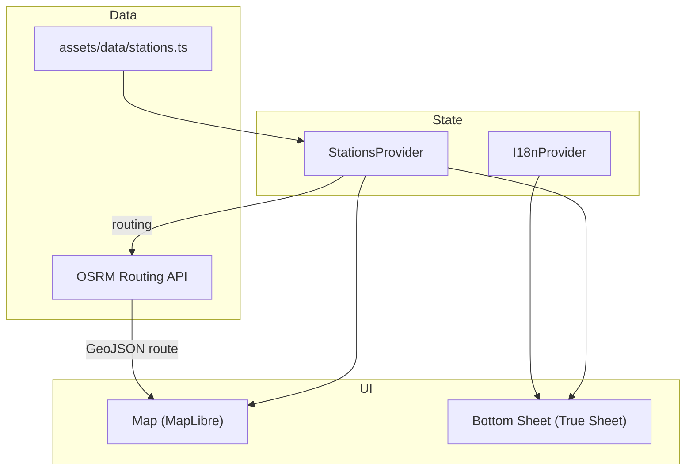

<div dir="rtl" align="right">

# ایستگاه · Istgah

**نقشه تعاملی ایستگاه‌های مترو تهران — با جستجو، مسیریابی و پشتیبانی کامل از فارسی**

[](https://expo.dev)
[](https://reactnative.dev)
[](https://www.typescriptlang.org)
[](https://maplibre.org)

---

## فهرست مطالب

- [درباره](#درباره)
- [ویژگی‌ها](#ویژگی‌ها)
- [پیش‌نیازها](#پیش‌نیازها)
- [نصب و راه‌اندازی](#نصب-و-راه‌اندازی)
- [اجرای برنامه](#اجرای-برنامه)
- [ساختار پروژه](#ساختار-پروژه)
- [معماری](#معماری)
- [داده‌ها](#داده‌ها)
- [فناوری‌ها](#فناوری‌ها)
- [مشارکت](#مشارکت)
- [مجوز](#مجوز)

---

## درباره

**ایستگاه** یک اپلیکیشن موبایل بومی (React Native) برای کاوش ایستگاه‌های مترو و BRT تهران است. همه ایستگاه‌های فعال روی نقشه نمایش داده می‌شوند؛ می‌توانید جستجو کنید، جزئیات هر ایستگاه را ببینید و از موقعیت فعلی‌تان تا ایستگاه انتخاب‌شده مسیریابی دریافت کنید.

رابط کاربری به‌صورت پیش‌فرض از زبان دستگاه پیروی می‌کند و بین **فارسی (RTL)** و **انگلیسی (LTR)** قابل تعویض است.

---

## ویژگی‌ها

| ویژگی | توضیح |
|--------|--------|
| **نقشه تعاملی** | نمایش ایستگاه‌ها با MapLibre؛ رنگ هر ایستگاه مطابق خط مترو |
| **جستجوی دوزبانه** | جستجو با نام فارسی یا انگلیسی |
| **برگه پایینی بومی** | تجربه روان با [True Sheet](https://github.com/lodev09/react-native-true-sheet) و Reanimated |
| **مسیریابی** | مسیر از موقعیت شما تا ایستگاه با OSRM (فاصله و زمان تخمینی) |
| **موقعیت‌یابی** | نمایش موقعیت کاربر روی نقشه و دکمه «مکان من» |
| **تم روشن / تاریک** | هماهنگ با نقشه و رابط کاربری |
| **پشتیبانی RTL** | چیدمان و متن مناسب برای فارسی |
| **۷ خط مترو + BRT** | داده کامل ایستگاه‌های فعال تهران |

---

## پیش‌نیازها

- [Node.js](https://nodejs.org) 18 یا جدیدتر
- [npm](https://www.npmjs.com) یا [yarn](https://yarnpkg.com)
- برای اندروید: [Android Studio](https://developer.android.com/studio) و SDK
- برای iOS (فقط macOS): [Xcode](https://developer.apple.com/xcode/)

> **توجه:** ماژول‌های بومی **MapLibre** و **True Sheet** در Expo Go به‌طور کامل پشتیبانی نمی‌شوند. برای تجربه کامل (نقشه و برگه پایینی) باید **development build** بسازید.

---

## نصب و راه‌اندازی

```bash
# کلون کردن مخزن
git clone https://github.com/MohsenDastaran/istgah-rn.git
cd istgah-rn

# نصب وابستگی‌ها
npm install

# ساخت پوشه‌های بومی (اولین بار)
npx expo prebuild
```

---

## اجرای برنامه

### سرور توسعه

```bash
npm run dev
```

### اندروید (development build — توصیه‌شده)

```bash
npm run android
# یا
npx expo run:android
```

### iOS

```bash
npm run ios
# یا
npx expo run:ios
```

### وب (نقشه محدود — بدون ماژول بومی MapLibre)

```bash
npm run web
```

### پاک‌سازی کش

```bash
npm run clean
npm install
```

---

## ساختار پروژه

```
istgah-rn/
├── app/                    # صفحات Expo Router
│   ├── _layout.tsx         # لایه ریشه، تم و Providerها
│   └── index.tsx           # صفحه اصلی (نقشه + برگه)
├── assets/data/
│   ├── stations.ts         # داده خام ایستگاه‌ها
│   └── metroLines.ts       # رنگ و نام خطوط
├── components/
│   ├── sheet-section.tsx   # برگه پایینی، جستجو، جزئیات ایستگاه
│   └── ui/                 # اجزای UI (نقشه، دکمه، …)
├── lib/
│   ├── i18n.ts             # ترجمه فارسی / انگلیسی
│   ├── stations.ts         # تبدیل داده و GeoJSON
│   ├── stations-context.tsx# state ایستگاه‌ها و مسیریابی
│   └── theme.ts            # تم ناوبری
└── types/
    └── station.ts          # تایپ داده ایستگاه
```

---

## معماری


**جریان کاربر:** جستجو یا لمس ایستگاه روی نقشه → انتخاب ایستگاه → «مسیریابی» → دریافت مسیر از OSRM → نمایش روی نقشه.

---

## داده‌ها

- بیش از **۱۰۰ ایستگاه فعال** در `assets/data/stations.ts`
- خطوط ۱ تا ۷ و BRT با رنگ‌های استاندارد در `assets/data/metroLines.ts`
- فقط ایستگاه‌هایی با `Is Active: "T"` در اپ نمایش داده می‌شوند
- مسیریابی از سرویس عمومی [OSRM](https://router.project-osrm.org) (حالت رانندگی؛ تخمینی)

---

## فناوری‌ها

| لایه | ابزار |
|------|--------|
| فریم‌ورک | [Expo 56](https://expo.dev) · [React Native 0.85](https://reactnative.dev) · [Expo Router](https://docs.expo.dev/router/introduction/) |
| زبان | [TypeScript](https://www.typescriptlang.org) |
| نقشه | [@maplibre/maplibre-react-native](https://github.com/maplibre/maplibre-react-native) |
| UI | [True Sheet](https://github.com/lodev09/react-native-true-sheet) · [Uniwind](https://uniwind.dev) · [RN Primitives](https://rnprimitives.com) |
| انیمیشن | [Reanimated 4](https://docs.swmansion.com/react-native-reanimated/) |
| موقعیت | [expo-location](https://docs.expo.dev/versions/latest/sdk/location/) |
| استایل نقشه | [CARTO Basemaps](https://carto.com/basemaps) |

---

## مشارکت

۱. Fork کنید  
۲. شاخه feature بسازید (`git checkout -b feature/amazing-feature`)  
۳. تغییرات را commit کنید  
۴. Push به شاخه (`git push origin feature/amazing-feature`)  
۵. Pull Request باز کنید  

---

## مجوز

این پروژه در حال حاضر **خصوصی** است (`private: true` در `package.json`). برای استفاده یا توزیع، با نگهدارنده مخزن هماهنگ کنید.

**نگهدارنده:** [Mohsen Dastaran](https://github.com/MohsenDastaran)

</div>

---

<div dir="ltr" align="left">

# Istgah · ایستگاه

**An interactive map of Tehran Metro stations — search, directions, and full Persian support**

[](https://expo.dev)
[](https://reactnative.dev)
[](https://www.typescriptlang.org)
[](https://maplibre.org)

---

## Table of Contents

- [About](#about)
- [Features](#features)
- [Prerequisites](#prerequisites)
- [Installation](#installation)
- [Running the App](#running-the-app)
- [Project Structure](#project-structure)
- [Architecture](#architecture-1)
- [Data](#data)
- [Tech Stack](#tech-stack)
- [Contributing](#contributing)
- [License](#license)

---

## About

**Istgah** (Persian for *station*) is a native mobile app built with React Native for exploring Tehran's metro and BRT stations. All active stations appear on an interactive map. Search by name, view station details, and get turn-by-turn-style routing from your current location to any station.

The UI follows the device locale by default and can be switched between **Persian (RTL)** and **English (LTR)** at any time.

---

## Features

| Feature | Description |
|---------|-------------|
| **Interactive map** | MapLibre-powered station markers colored by metro line |
| **Bilingual search** | Filter stations by Persian or English name |
| **Native bottom sheet** | Fluid UX with [True Sheet](https://github.com/lodev09/react-native-true-sheet) and Reanimated |
| **Directions** | Route from your location to a station via OSRM (distance & ETA) |
| **User location** | Live position on the map with a "locate me" control |
| **Light / dark theme** | Synchronized map basemap and app chrome |
| **RTL support** | Layout and typography tuned for Persian |
| **7 metro lines + BRT** | Complete dataset of active Tehran stations |

---

## Prerequisites

- [Node.js](https://nodejs.org) 18+
- [npm](https://www.npmjs.com) or [yarn](https://yarnpkg.com)
- For Android: [Android Studio](https://developer.android.com/studio) and the Android SDK
- For iOS (macOS only): [Xcode](https://developer.apple.com/xcode/)

> **Note:** Native modules **MapLibre** and **True Sheet** are not fully available in Expo Go. Build a **development build** for the complete experience (map + bottom sheet).

---

## Installation

```bash
# Clone the repository
git clone https://github.com/MohsenDastaran/istgah-rn.git
cd istgah-rn

# Install dependencies
npm install

# Generate native projects (first time)
npx expo prebuild
```

---

## Running the App

### Development server

```bash
npm run dev
```

### Android (development build — recommended)

```bash
npm run android
# or
npx expo run:android
```

### iOS

```bash
npm run ios
# or
npx expo run:ios
```

### Web (limited — no native MapLibre module)

```bash
npm run web
```

### Clean install

```bash
npm run clean
npm install
```

---

## Project Structure

```
istgah-rn/
├── app/                    # Expo Router screens
│   ├── _layout.tsx         # Root layout, theme, providers
│   └── index.tsx           # Main screen (map + sheet)
├── assets/data/
│   ├── stations.ts         # Raw station dataset
│   └── metroLines.ts       # Line colors and names
├── components/
│   ├── sheet-section.tsx   # Bottom sheet, search, station detail
│   └── ui/                 # UI primitives (map, button, …)
├── lib/
│   ├── i18n.ts             # Persian / English strings
│   ├── stations.ts         # Data transforms & GeoJSON
│   ├── stations-context.tsx# Station state & routing
│   └── theme.ts            # Navigation theme
└── types/
    └── station.ts          # Station type definitions
```

---

## Architecture



**User flow:** Search or tap a station on the map → select station → "Get Directions" → fetch route from OSRM → render on map.

---

## Data

- **100+ active stations** in `assets/data/stations.ts`
- Lines 1–7 and BRT with standard colors in `assets/data/metroLines.ts`
- Only stations marked `Is Active: "T"` are shown in the app
- Routing uses the public [OSRM](https://router.project-osrm.org) API (driving profile; approximate)

---

## Tech Stack

| Layer | Tools |
|-------|-------|
| Framework | [Expo 56](https://expo.dev) · [React Native 0.85](https://reactnative.dev) · [Expo Router](https://docs.expo.dev/router/introduction/) |
| Language | [TypeScript](https://www.typescriptlang.org) |
| Maps | [@maplibre/maplibre-react-native](https://github.com/maplibre/maplibre-react-native) |
| UI | [True Sheet](https://github.com/lodev09/react-native-true-sheet) · [Uniwind](https://uniwind.dev) · [RN Primitives](https://rnprimitives.com) |
| Animation | [Reanimated 4](https://docs.swmansion.com/react-native-reanimated/) |
| Location | [expo-location](https://docs.expo.dev/versions/latest/sdk/location/) |
| Map tiles | [CARTO Basemaps](https://carto.com/basemaps) |

---

## Contributing

1. Fork the repo  
2. Create a feature branch (`git checkout -b feature/amazing-feature`)  
3. Commit your changes  
4. Push to the branch (`git push origin feature/amazing-feature`)  
5. Open a Pull Request  

---

## License

This project is currently **private** (`private: true` in `package.json`). Contact the maintainer for usage or distribution terms.

**Maintainer:** [Mohsen Dastaran](https://github.com/MohsenDastaran)

</div>
